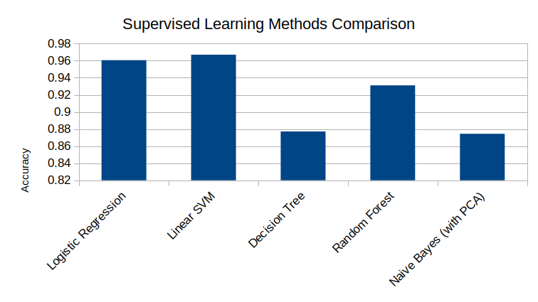

# Project Title : Activity Recognition using Mobile Sensor Data

## Project Overview and Motivation
The goal of this project is to classify human actions into one of the following categories:-
  1. Walking
  2. Walking Upstairs
  3. Walking Downstairs
  4. Sitting
  5. Standing
  6. Laying
 
based upon the values generated by sensors such as Accelerometer and Gyrometer embedded in a Smart Watch.

The classification of sensor values to human activities is now a very important component of many health applications. We aim to compare the results obtained by different supervised and unsupervised learning models.
In the process of obtaining the results, we will draw conclusions and try to answer the following questions:

1. Can we identify a user using sensor data generated by his actions?
2. Which sensor is more important, Accelerometer or Gyrometer?
3. Which Activity is recorded with the highest accuracy?

## Dataset
#### Dataset:Human Activity Recognition with Smartphones (Kaggle)
We are using human activity recognition dataset[1] that encompasses readings of a gyroscope and accelerometer from a smartphone to determine a person’s actions(Walking - on any gradient, laying, sitting and standing).
The Dataset is split into Train.csv and Test.csv. Train.csv contains Activity label for each record in the dataset.

Dataset        | Number of Records | Number of Attributes
-------------- | ----------------- | --------------------
Train.csv      | 7353              | 561
Test.csv       | 2948              | 561

#### Attribute Information
For each record in the dataset the following is provided:

1. Triaxial acceleration from the accelerometer (total acceleration) and the estimated body acceleration.
2. Triaxial Angular velocity from the gyroscope.
3. A 561-feature vector with time and frequency domain variables.
4. Activity label.
5. An identifier of the subject who carried out the experiment.

#### Dataset Visualisation
The following plot displays Number of records per activity in Train.csv.

As shown in the above plot, the dataset is well distributed among the 6 categories of Human Activity.

#### Activity Distribution:

We needed to delve deeper into our dataset. We decided to find out if our activities are separable and if they follow similar distributions. Therefore, we used a TSNE (T-distributed Stochastic Neighbor Embedding) plot, which is a dimensionality reduction technique similar to PCA that simplifies large datasets. It’s ideal for our use case because it tends to cope better with non-linear signals, so odd outliers tend to have less of an effect, and often the visible separation between relevant groups is improved.

#### Observations:

We saw that our data can be separated out in terms of activities. It is a vital insight as it provides us  intuition that the prediction algorithms can perform well for the data. We also observed that activities such as walking , walking - downstairs and walking - upstairs are closely associated and it might pose a challenge to distinguish between those. On the other hand, laying is well separated out as we’d expected.

## Approach
For the dataset, we use a number of Supervised and Unsupervised Learning methods to build a model that predicts what action a person is performing at a point in time given their sensor readings. For the supervised learning methods, we implemented the following:

1. Logistic Regression
2. Linear SVM
3. Decision Tree
4. Naive Bayes
5. Random Forest

Since we have labeled data available, it made sense to build and train models based on supervised learning and calculate the accuracy obtained for each model. Since we have 6 different activiteies available, it is also possible to determine which action is best determined by any given model. 

For Unsupervised Learning, we implemented the following:

1. PCA
2. K-means clustering

For unsupervised learning, we first stripped the labels off from the data and then used the methods above to build and train the models. We wish to find whether the unsupervised models are as accurate as the supervised models or not and whether we can determine which persosn's data was gathered out of all the people who participated in the activities.

## Unsupervised Learning

Our unsupervised learning methods consisted of using feature selection to determine the most important features in the data in terms of their impact on determining the resulting activity. In addition, we decided to use K-means to test if we could classify the data to be similar to their original classifications. However, because there were over 500 features to consider, we decided we also needed to do Principal Component Analysis to better tune the data so that K-means would operate better. 

We ran Feature Selection on the features using Feature Importance as our metric. This gave each feature a score based on how much it contributed to the output. We then took the top 20 scores from this evaluation and have plotted them in the graph shown. We then ran the data through PCA with a 99% recovered variance rate to reduce the number of features down to slightly over 150. We used the results of the PCA data as the input for K-means, which sorted the data into 6 groups, corresponding to the 6 output activities possible. 

#### Top 20 Most Important Features

Unfortunately, the clusters that formed from the algorithm did not frequently converge to the true results of the data. This is likely because of the random nature of initialization, as over 7000 data points would result in many potential initial centers, most of which often not the true centers of the actual data. The visualizations, using the 3 most principal features as coordinates, are shown below.
 
#### K-means on PCA dataset

#### Actual Distribution of Output

#### Variance for each component

## Supervised Learning Methods

##### Splitting the Data into Training and Validation Data

We split the given training dataset into training and validation datasets for experiments over various supervised learning techniques. The data rows were split randomly.
- Training data: 90% of the data, amounting to 6616/7352 rows.
- Validation data: 10% of the data, amounting to 736/7352 rows.

##### Metrics used for Evaluation

Since the dataset is almost balanced (i.e. no major class imbalance problem), accuracy is a good metric for evaluation. We have used accuracy to do the comparisons among different models. In addition, we have also calculated class-wise Recall, Precision and F-scores to gain greater insights into model results.

##### Comparison

SVM and Logistic Regression performed the best with respect to accuracy.

We observed that test set accuracy is always lower than validation set accuracy by at least 2%. This is due to the nature of the dataset. The data is split into train+val and test in a way that test set comprises of data of different users altogether, whereas the validation data can comprise of same users as training data. Different users may follow different patterns, which is justified by the lower test accuracy than validation accuracy.

Also, among the classes it is seen that LAYING is the easiest to classify, whereas SITTING is difficult and somewhat likely to be misclassified as STANDING, as can be seen from the results of different methods below.

Please find the detailed analysis of each method below.

### SUPPORT VECTOR MACHINE

SVM provides the best results for our dataset. Among the different kernel functions, Linear kernel gave the best performance. Here are the results for different kernel methods:

Metrics using Linear SVM             |  Confusion Matrix using Linear SVM  
:-------------------------:|:-------------------------:
   |  

The class "SITTING" performs the worst among all true labels, and a lot of labels from class "SITTING" are misclassified as "STANDING".

##### Experimentation with Regularization Strength and Regularization Type (L1 / L2 regularizer)

There wasn't a significant difference between results with various values of the regularization strength and types, but we see that the highest accuracy on the validation set is achieved using L1 regularization. This can be explained since the number of features are very high (561 to be precise) and L1 regularizer provides sparse features. Hence it is is expected that L1 regularizer eliminates the less useful features.

##### SVM on reduced features

Since the number of features is high, we experimented with SVM after feature extraction using PCA. Though this did not improve performance, but we could conclude that SVM with dimensions reduced to 155 (capturing 99% variance of the data) has same performance has original data of 561 features.

Accuracy vs PCA variance             |  Number of features vs PCA variance  
:-------------------------:|:-------------------------:
   |  

##### Class weights 

As evident from confusion matrix, the class SITTING is the most mis-classified class (F1-score for SITTING is 92%). Hence we experimented with assigning class weights other than the default (default assigns weight 1 to each class).

SITTING: 4, STANDING: 3, rest: 1             |  Balanced class weighting (According to number of examples in the dataset)  
:-------------------------:|:-------------------------:
   |  

As we see, there isn't a significant improvement to the distribution. Hence we can conclude that the mis-classified examples from the class SITTING are highly difficult and inseparable examples.

### LOGISTIC REGRESSION

The performance of logistic regression is comparable to SVM and the results are similar. We achieve a validation accuracy of 98.5% and testing accuracy of 96% on average.

Metrics using Logistic Regression             |  Confusion Matrix using Logistic Regression 
:-------------------------:|:-------------------------:
   |  

Here again, as in SVM, the class "SITTING" performs the worst among all true labels, and a lot of labels from class "SITTING" are misclassified as "STANDING".

##### Experimentation with Regularization Strength, Regularization Type and Multi-class (L1 / L2 regularizer)

Consistent with linear SVM, there wasn't a significant difference between results with various values of the regularization strength and types, but we see that the highest accuracy on the validation set is achieved using L1 regularization. This can be explained since the number of features are very high (561 to be precise) and L1 regularizer provides sparse features. Hence it is is expected that L1 regularizer eliminates the less useful features.

Additionally, we experimented with one-vs-all output, which computes the result for each class separately, and multinomial logistic regression, which uses a softmax to output collective probability distribution for all classes. One-vs-rest provided best results on validation dataset, but the difference is marginal.

Very high regularization (C=0.1) reduces the validation accuracy, which is expected since the model underfits under such conditions.

##### Logistic Regression on reduced features

Since the number of features is high, we experimented with Logistic Regression after feature extraction using PCA. This too did not improve performance, but it was observed that only 34 features carrying 90% variance of the data produce a reasonable test accuracy of 91%. Hence reducing the number of features from 561 to 34 independent features reduced the accuracy only 5% (from 96 to 91).

Accuracy vs PCA variance for Logistic Regression            |  Number of features vs PCA variance for Logistic Regression
:-------------------------:|:-------------------------:
   |  

##### Class weights 

As evident from confusion matrix, the class SITTING is the most mis-classified class (F1-score for SITTING is 92%). Hence we experimented with assigning class weights other than the default (default assigns weight 1 to each class). The manual weighting led to a marginal increase of F1-score of SITTING class to 93%, and balanced weighting did not produce any changes.

SITTING: 4, STANDING: 3, rest: 1             |  Balanced class weighting (According to number of examples in the dataset)  
:-------------------------:|:-------------------------:
   |  

As we see, there isn't any improvement to the distribution. Hence we can conclude that the mis-classified examples from the class SITTING are highly difficult and inseparable examples.

### DECISION TREE

Decision Tree did not result in a comparable performance. A simple decision tree resulted in a test accuracy of only 85.6% and a decision tree where the tree depth was limited improved the accuracy to 87.7%. The increment is expected as limiting the depth of the decision tree curbs the overfitting.

Decision Tree             |  Decision Tree with Limited Depth  
:-------------------------:|:-------------------------:
   |  

We observe that decision tree too faces difficulty in classifying the SITTING class, though it also highly misclassifies WALKING_UPSTAIRS into WALKING and WALKING_DOWNSTAIRS. 

### NAIVE BAYES

Gaussian distribution is the most suitable distribution to model the data for Naive Bayes, since Gaussian Naive Bayes does not place any restrictions on the feature values.

Gaussian Naive Bayes scored a test accuracy of 74% for our dataset. This is expected since Naive Bayes assumes that the features are independent, which is definitely not the case for our dataset. 

##### Naive Bayes on reduced and independent features

However, we also experimented Naive Bayes on features from PCA since PCA returns independent features. This improved the performance of Naive Bayes remarkably from 74% to 87% with features comprising 95% variance, comparable to the accuracy of Decision Tree.

Accuracy vs PCA variance for Naive Bayes            |  Number of features vs PCA variance for Naive Bayes
:-------------------------:|:-------------------------:
   |  

### RANDOM FOREST

Random forest, being an ensemble method over decision trees is expected to perform better than a single decision tree and this reflected in our results too. Random forest resulted in 92.9% test accuracy and 93.1% accuracy with limited depth. It is a huge improvement over decision tree, but still not comparable to logistic regression and SVM models.

## Discussion

We observed that this activity dataset can be distilled and leveraged to identify patterns by clustering and separating into various activities. Running k-means on the dataset is beneficial because it gave us fast and reliable results because our data generated by sensors could be separated out in a linear fashion. It was vital to understand our data first and figure out if it’s feasible to perform supervised learning and if it could get us reliable results. This might seem insignificant at the moment , but just consider situations where you have much higher volume and velocity of data. You might spend a considerable amount of resources in terms of computational power , money and effort only to find out that it is non-trivial to execute conventional supervised learning algorithms on your data-sets. Therefore, it might be prudent to explore and perform basic clustering algorithms first to figure out the principle dimensionality , select features or assign cluster labels. 
Another viable option that we had considered was to perform semi-supervised learning algorithms , however we found that we have sufficient labelled data to go ahead with supervised learning algorithms. Another reason was that unsupervised learning techniques were able to provide us with ample insights. So, we found best to go ahead with this approach.

Plotting T-distributed Stochastic Neighbor Embedding (t-SNE) distribution allowed us to glean important information from our data. 
First, as described above in an earlier section, it allows us to see that the activity labels can be separated out and running clustering algorithms is a viable option. We went with K-Means as we knew the number of activities (k in k-means) beforehand and we needed a hard clustering technique.
Second, plotting t-SNE participant-wise showed us that even within groups of activities, the sheer amount of sensor data allows us to identify specific user clusters.

We can make a leap and fathom the implications of this idea. For instance, consider the next time a sensitive device gets stolen, even after efforts of gps-spoofing, we might triangulate the criminal based on it’s behavior of sensor data. Or , consider the negative implications of this , where the government or corporations might get just enough data from your smartphone sensors to track your daily activities.

## Conclusions

After analysing the dataset through PCA and using the prediction models to determine the labels for unlabeled data, we are in a position to answer the questions from Section 1.

### Which sensor is more important, Accelerometer or Gyrometer?

Both Accelerometer and Gyrometer are an important part of any wearable/fitness tracking device. Although, it is true that both perform integral functions for tracking human activities, but, based upon our research, we found out one plays a more important role than the other.

#### Accelerometer
Accelerometers are electromechanical devices that measure acceleration, the rate of change in velocity of an object. It is  used to respond to any vibrations associated with movement.
Accelerometers are widely used in electronic devices for:-
1. Tilt Sensing, to sense whether the device is being held in portrait or landscape mode.
2. Games/applications that require motion sensing.
3. Fitness trackers/wearables, to sense motion.

#### GyroScope
Gyroscope is a device used for measuring rotational changes or maintaining orientation. It’s based on the principle of preserving angular momentum.
Gyroscope works on top of Accelerometer to fill in the missing information about orientation and twist.

#### Comparision
To compare the significance of Accelerometer and Gyroscope, we trained a State Vector Classifier on our training dataset. We used the trained SVC to determine the weight associated with each of the feature in our dataset. Next, we summed up the weights of features associated with Accelerometer and Gyroscope to obtain the following plot:

### Which Activity is recorded with the highest accuracy?

The below plot displays the prediction accuracy for Logistic Regression, State Vector Classifier, Decision Trees, Naive Bayes Classifier and Random Forest for both Training Dataset and Testing Dataset.

In the above plot, we analysed the percentage of records that were predicted correctly by different models.

Based upon our research, we understood that not all activities are predicted with same accuracy. For example, 'LAYING' is an activity which is very distinctive as it require very less movement compared to other activities. However, 'WALKING' and 'CLIMBING_UPSTAIRS' are two very similar activities. Hence, it is possible that our classifier can get confused between the two and predict incorrectly.

Thus, we decided to delve even deeper and analyse the percentage of records in each activity that were predicted correctly.
We trained Logistic Regression prediction model on our training dataset. Next, we determined the accuracy of prediction for records belonging to ['STANDING', 'SITTING', 'LAYING', 'WALKING', 'WALKING_UPSTAIRS', WALKING_DOWNSTAIRS] seperately. 

It can be seen that the activity 'LAYING' is predicted with 100% accuracy due to it's distinctive nature. However, 'SITTING' is predicted with low accuracy of 87% as it can be confused with 'STANDING'.

## References

[1] E. Bulbul, A. Cetin and I. A. Dogru, "Human Activity Recognition Using Smartphones," 2018 2nd International Symposium on Multidisciplinary Studies and Innovative Technologies (ISMSIT), Ankara, 2018, pp. 1-6.

[2] Dataset source: https://www.kaggle.com/uciml/human-activity-recognition-with-smartphones.

[3] Sklearn documentation. https://scikit-learn.org/stable/user_guide.html

[4] Matplotlib documentation: https://matplotlib.org

[5] Accelerometers: What They Are & How They Work: https://www.livescience.com/40102-accelerometers.html

[6] Gyro sensors - How they work and what's ahead: https://www5.epsondevice.com/en/information/technical_info/gyro/

[7] Accelerometer vs. Gyroscope: What's the Difference?: https://www.livescience.com/40103-accelerometer-vs-gyroscope.html 

[8] Activity recognition. (2020, April 15). Retrieved from https://en.wikipedia.org/wiki/Activity_recognition

[9] Brownlee, J. (2019, August 5). How to Model Human Activity From Smartphone Data. Retrieved from https://machinelearningmastery.com/how-to-model-human-activity-from-smartphone-data/

[10] Fan, L., Wang, Z., & Wang, H. (2013). Human Activity Recognition Model Based on Decision Tree. 2013 International Conference on Advanced Cloud and Big Data. doi: 10.1109/cbd.2013.19

[11] Tapia, E. M., Intille, S. S., & Larson, K. (2004). Activity Recognition in the Home Using Simple and Ubiquitous Sensors. Lecture Notes in Computer Science Pervasive Computing, 158–175. doi: 10.1007/978-3-540-24646-6_10

## Contributions

Sections                    | Contributors
--------------------------- | -----------------------------------------
Overview and Motivation     | Guneet Khosla          
Dataset visualization       | Guneet Khosla, Pranit Kaul
Approach                    | Akshat Thakkar
Unsupervised Learning       | Nishit Undale
Supervised Learning         | Parul Aggarwal
Visualisations              | Guneet Khosla, Parul Aggarwal, Pranit Kaul, Akshat Thakkar
Discussion                  | Pranit Kaul
Conclusion                  | Guneet Khosla
